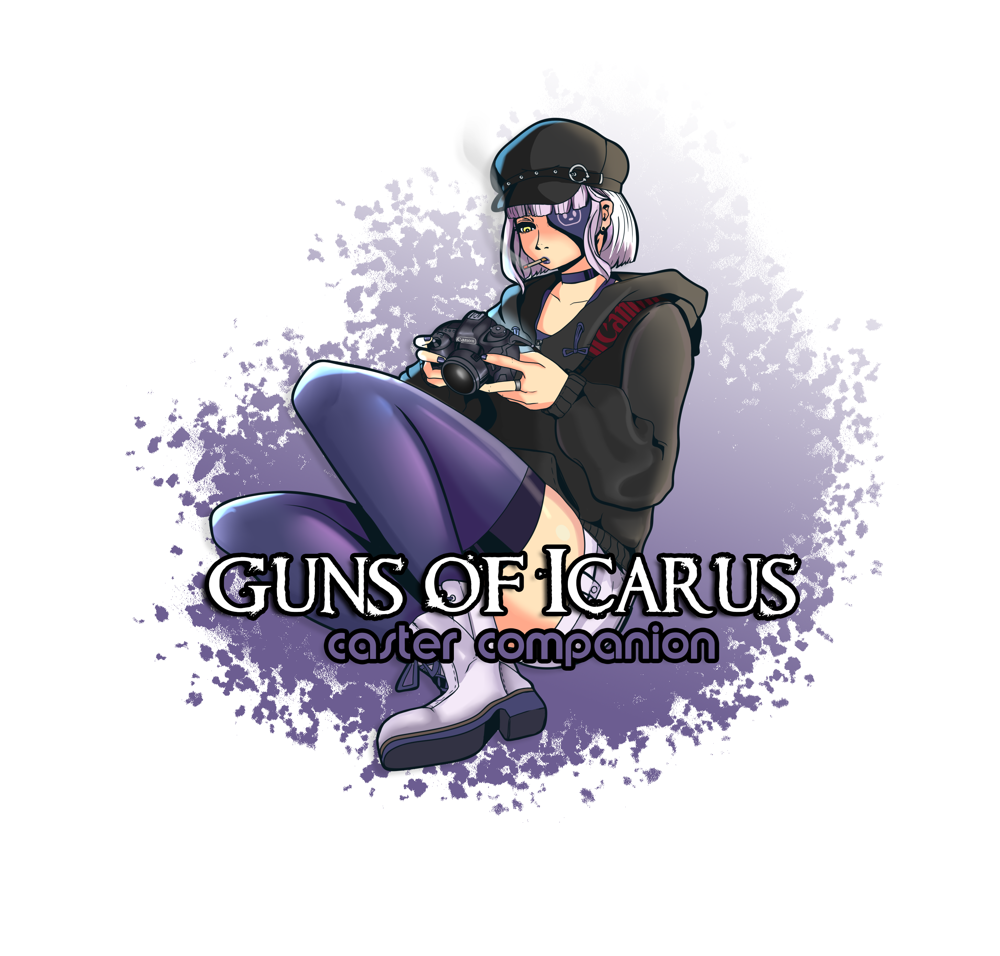
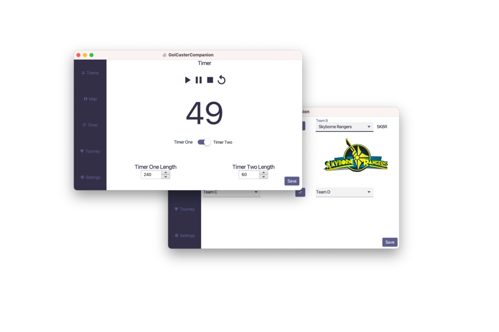

  

#### [GoICC.Skyborne.net](https://goicc.skyborne.net)
Guns of Icarus Caster Companion - formerly GoIStreamToolRedux - is a cross-platform application designed to assist [Guns of Icarus](https://gunsoficarus.com/) tournament broadcasters with their interfaces and overlays. It includes UI management for teams, maps, timers, and tournament info that all ties into an output folder, providing OBS (or other casting tool) with static file paths to read from. The GoICC project started as an adaptation of the original closed-course Windows application [GoiStreamTool](https://urzlab.com/goistreamtool/) by former GoI player and caster Urz.

## Installers
The [latest release](https://github.com/RVRX/GoICasterCompanion/releases/latest) should contain the application installers under "assets." There are installers for Mac OS and Windows platforms.
A Jar version is also available for other operating systems (libraries should be bundled into the JAR, might need Java 8 Installed).

